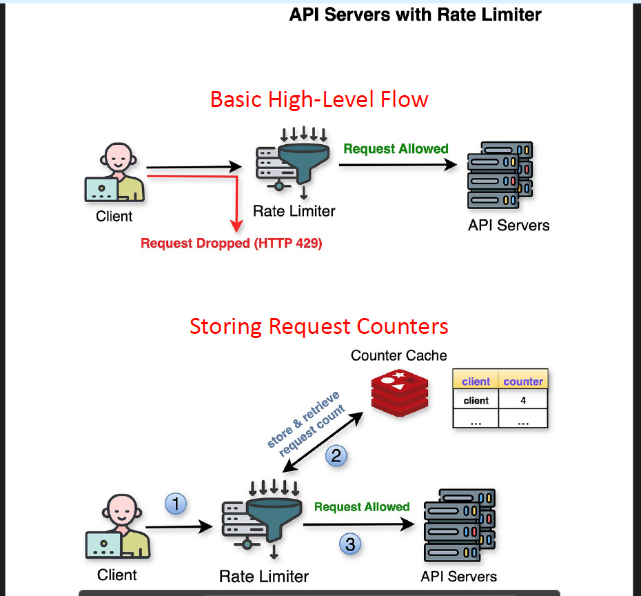
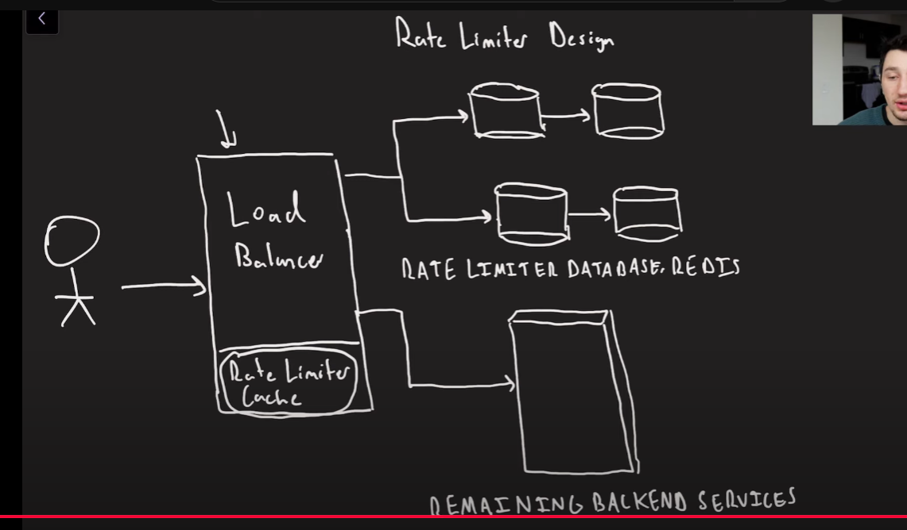

# ⚡️ High-Performance Rate Limiter – Design & Implementation

## 📘 Overview

This project implements a **distributed, low-latency rate limiter** that:

* Prevents abuse of API endpoints
* Supports multiple algorithms
* Minimizes impact on backend services
* Scales independently and reliably

Built to handle **billions of users and millions of requests per second**, it includes:

* Fixed and Sliding Window algorithms
* Redis-based state store with single-leader replication
* Optional load balancer-level caching for popular clients

---

## 📌 Core Features

* 🔒 Prevents overuse of public/private API endpoints
* 📊 Works by user ID or IP address
* 🧠 Supports multiple algorithms:

  * Fixed Window
  * Sliding Window
* 🧠 Thread-safe with locking/concurrent data structures
* ⚙ In-memory store (Redis) for low-latency checks
* 🔁 Horizontally scalable with partitioned Redis shards

---

## 📈 Capacity & Scaling

* 🧑‍🤝‍🧑 **1 Billion Users**
* 🚀 **20 Services per User**
* 💾 Est. Storage: `~240 GB` of counters (user × services × metadata)
* 🧠 Stored in Redis partitions, replicated for fault tolerance

---

## 📐 Design Goals

| Goal           | Strategy                                |
| -------------- | --------------------------------------- |
| ⏱ Low latency  | In-memory store (Redis) + caching       |
| 💪 Scalability | Partitioned Redis + horizontal services |
| 🎯 Accuracy    | Single-leader writes, optional CRDTs    |
| 🧩 Flexibility | Pluggable rate-limiting algorithms      |
| 🔐 Resilience  | Backup Redis replicas, retry logic      |

---

## ⚙ Rate Limiting API

```ts
interface RateLimiter {
  boolean rateLimit(
    String? userId,
    String ipAddress,
    String serviceName,
    long timestamp
  )
}
```

* `userId`: Nullable (optional for public endpoints)
* `ipAddress`: Always available for fallback
* `serviceName`: Name of the API being limited
* `timestamp`: For algorithmic tracking

---

## 🧠 Algorithms Implemented

### 1. 🧊 Fixed Window

```text
Rate = 2 requests / minute
Window = [1:00 to 1:01)
Valid: 2 requests in that interval
Reset: counter = 0 at 1:01
```

**State format:**

```ts
Map<Service, Map<User, (MinuteWindow, Count)>>
```

**Pros:**

* Simple and memory efficient

**Cons:**

* Allows bursts at window edges (e.g., 2 at 12:00:59 and 2 at 12:01:00)

---

### 2. 🪟 Sliding Window

```text
Rate = 2 requests / 60s
Window = current time - 60s
LinkedList = Timestamps of past requests
Purge old entries, count remaining
```

**Data structure:**

```ts
Map<Service, Map<User, Deque<Timestamp>>>
```

**Pros:**

* Smoother, fairer throttling

**Cons:**

* Slightly more memory intensive

---

## 🗃 Storage Design – Redis

### Chosen: **Redis** with **Single-Leader Replication**

* ⚡ Blazing fast reads/writes
* ✅ Built-in data structures (List, HashMap)
* 🧠 Easy to replicate
* 💥 Supports failover with Sentinel or Cluster mode

---

## 🏗 Architecture

```text
Client
  ↓
Load Balancer (w/ optional local rate cache)
  ↓
Rate Limiter Service
  ↓
Redis Partition (Sharded by user/IP)
  ↓
Backend API (if allowed)
```

### Caching Strategy (optional)

* For "hot" users/IPs
* Load balancer can locally track request counts
* Reduces Redis hits for heavy clients

---

## 🔀 Replication Models Considered

| Model             | Verdict  | Why                                |
| ----------------- | -------- | ---------------------------------- |
| Single Leader     | ✅ Chosen | Accurate counts, simple failover   |
| Multi-Leader      | ❌ No     | Delay in consistency, merge issues |
| Leaderless (CRDT) | ❌ No     | Inexact counts, high complexity    |

---

## 💡 Placement Tradeoffs

| Approach               | Pros                              | Cons                                        |
| ---------------------- | --------------------------------- | ------------------------------------------- |
| **Inline in service**  | No extra latency, simple          | Doesn’t block spam traffic, scales with app |
| **Standalone service** | Decoupled, centralized, cacheable | Extra hop in request path                   |
| **LB cache hybrid**    | Shields Redis from hot users      | Complex invalidation, consistency           |

---

## 🚦 Thread Safety

### Issues Handled

* Atomic increments (for counters)
* Concurrent writes to lists
* Lost updates / race conditions

### Fixes

* Use Redis atomic ops (e.g., `INCR`)
* Use thread-safe collections if in app memory
* Synchronization/locking around critical sections

---

## 📦 Deployment Strategy

* Redis Clusters with partitioned keyspace (by user/IP hash)
* Multiple rate limiter services, stateless
* Load balancers round-robin or hash route traffic
* Cache layer at LB (optional)

---

## 🔍 Example Use Case

```http
POST /api/v1/post-comment
User: 12345
IP: 192.168.1.10

→ Load Balancer checks cache
→ If not limited, call RateLimiter Service
→ RateLimiter hits Redis partition
→ Pass/fail based on limit
→ Route to comment service if allowed
```

---

## ✅ TL;DR

| Feature         | Summary                                    |
| --------------- | ------------------------------------------ |
| Rate Algorithms | Fixed window, sliding window               |
| DB Backend      | Redis (partitioned, single-leader)         |
| Fault Tolerance | Redis replication, load-balanced services  |
| Caching         | Optional hot-client cache in load balancer |
| Scalability     | Horizontal (services + Redis partitions)   |
| Use cases       | API protection, abuse prevention, fairness |

---


