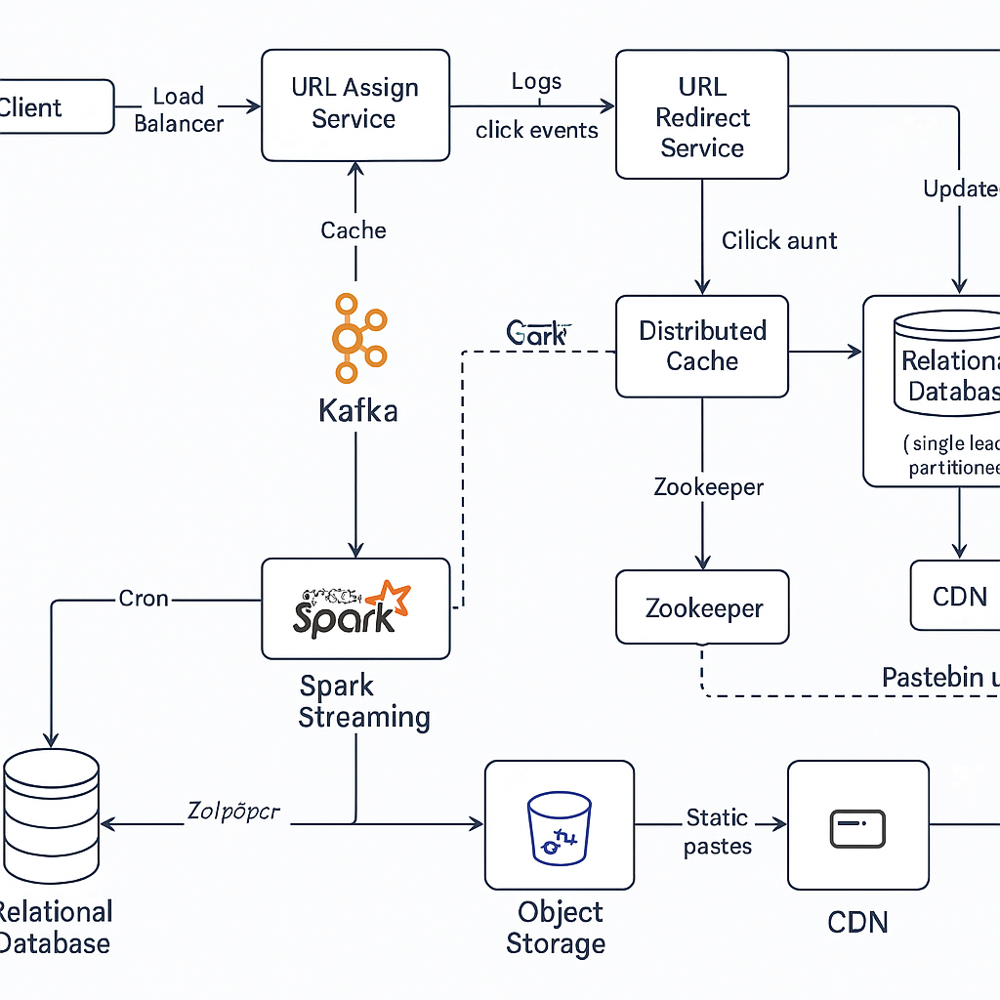

Sure! Here's the complete `README.md` file with everything—explanation, architecture, tech choices, and design insights—packaged into one clean and professional file for your `tiny-url-preparation` GitHub repository:

---

````markdown
# 📎 TinyURL & Pastebin System Design – Interview Preparation

This project documents a complete **system design** for building services like **TinyURL** and **Pastebin**, aimed at high-level **system design interviews**. The focus is on **scalability**, **performance**, **consistency**, and **real-world trade-offs**.

---

## 📌 Problem Statement

Design a system that:
- Shortens long URLs into unique, minimal short links.
- Redirects users when short links are visited.
- Tracks number of clicks per link.
- Supports optional expiration of links.
- (Pastebin) Stores and delivers large plain-text pastes (up to GBs in size).

---

## 🧱 High-Level Architecture

### 🔸 Key Components

- **URL Assigning Service**: Generates and stores short links.
- **URL Redirect Service**: Resolves short links and logs clicks.
- **Relational Database (MySQL)**: Stores short link mappings and metadata.
- **Distributed Cache (Redis)**: Caches hot short links for faster lookup.
- **Kafka + Spark Streaming**: Collects and processes click analytics.
- **Object Storage (S3)**: Stores large pastes for Pastebin use case.
- **CDN**: Distributes large static pastes to users quickly.
- **Zookeeper**: Coordinates partition metadata and service discovery.

---

## 🎯 Functional Requirements

- Create short URLs and redirect them reliably.
- Ensure **uniqueness** of short links.
- Support **expiration times**.
- Handle **1T+ short links**, **millions of reads per link**, and **billions of clicks**.
- Pastebin: Support storing up to **10GB** pastes.

---

## 🧠 Short Link Generation

- Use `hash(long URL + user ID + timestamp)` to avoid global locks.
- Encode in **Base36** (0-9, A-Z): `36^8 ≈ 2T` unique short links.
- Handle **hash collisions** via **probing** (e.g., `abc123 → abc124`).

---

## 💾 Data Modeling

```sql
CREATE TABLE short_urls (
    short_url VARCHAR(10) PRIMARY KEY,
    original_url TEXT,
    user_id VARCHAR(64),
    created_at DATETIME,
    expire_at DATETIME,
    click_count INT
);
````

---

## ⚡ Write Strategy

* **Avoid global counters** or multi-leader replication.
* Use **single-leader replication + partitioning** (A–M, N–Z).
* Handle write collisions via:

  * **Predicate locks** (locking on non-existent rows).
  * Or **pre-populating all possible keys** (\~16TB).

---

## 🚀 Read Optimization

* **Caching**: Redis (write-around, LRU eviction).
* **Partition-aware**: Cache & DB both partitioned by short URL prefix.
* **Replication**: Use read replicas for scale.
* On cache miss:

  * DB lookup → Load cache → Return to user.

---

## 📊 Click Analytics Design

* Direct DB writes cause contention → use **streaming pipeline**:

  * Writers log click events to **Kafka**.
  * **Spark Streaming** mini-batches updates (e.g., 10 clicks → 1 DB write).
* Ensure **idempotency** with unique event keys.
* Partition Kafka & Spark consumers by short URL for **exclusive ownership**.

---

## ⏱️ Expired Links Cleanup

* Nightly **cron job** scans and deletes rows where:

  ```
  expire_at < NOW()
  ```

---

## 🗂️ Pastebin-Specific Considerations

* Store large pastes in **Amazon S3** or equivalent object storage.
* Use **CDN** for fast, geo-distributed static delivery.
* Write Order: `CDN → S3 → DB` (ensures availability before metadata exists).
* Use **write-through caching** (prevent costly cache misses on first read).

---

## 🛠️ Technology Stack

| Layer            | Technology           |
| ---------------- | -------------------- |
| Database         | MySQL (B-tree index) |
| Cache            | Redis                |
| Message Broker   | Kafka                |
| Stream Processor | Spark Streaming      |
| Object Storage   | Amazon S3            |
| CDN              | CloudFront/Fastly    |
| Coordination     | Zookeeper            |
| Scheduler        | Cron                 |

---

## ⚙️ Design Trade-offs

| Concern         | Decision & Justification                                |
| --------------- | ------------------------------------------------------- |
| Write Conflicts | Predicate locking or key prewrites                      |
| Hash Collisions | Probing instead of chaining                             |
| Consistency     | Single-leader DB + idempotent analytics                 |
| Cache Strategy  | Write-around for regular URLs, write-through for pastes |
| Analytics Scale | Stream processing (Kafka + Spark mini-batching)         |
| Hot Links       | Partition-aware cache with replication                  |
| Fault Tolerance | Kafka (durable), Spark (resumable), Zookeeper (HA)      |

---

## 🗺️ Architecture Flow

```text
Writer (Short URL):
  → Load Balancer
    → URL Assignment Service
      → DB (write, lock, partitioned)
      → Kafka (publish click event)

Reader (Short URL):
  → Load Balancer
    → URL Redirect Service
      → Redis (lookup)
         ↳ DB fallback
      → Kafka (log click)

Analytics Pipeline:
  Kafka → Spark Streaming (mini-batches) → MySQL (click count update)

Pastebin (Writer):
  → CDN → S3 → MySQL metadata

Pastebin (Reader):
  → CDN cache (or fallback to S3)

Expired Links:
  → Cron job → DB scan + cleanup

Zookeeper:
  → Tracks partition mapping, coordination info
```

---

## 📈 Scaling & Performance

* **Reads >> Writes** → focus on caching and replication.
* **Sharded infrastructure** for horizontal scalability.
* **Mini-batching** improves throughput and reduces DB contention.
* **Eventual consistency** for reads, **strong consistency** for short link creation.

---

## 📎 Summary

This design prioritizes:

* 🔄 **Scalability**: Partitioned services, distributed caches, stream processing.
* 🛡️ **Correctness**: Locks or unique keyspace, idempotent writes, transactional safety.
* 🚀 **Performance**: High read throughput, low latency redirects, fast analytics.

---


## 🗺️ Architecture Diagram




