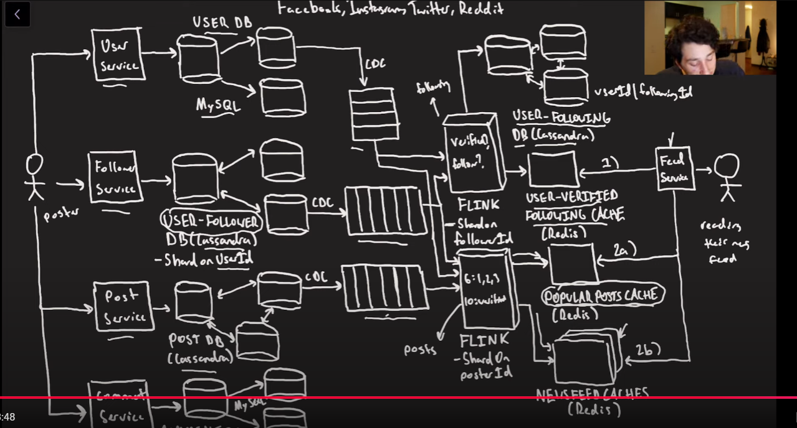
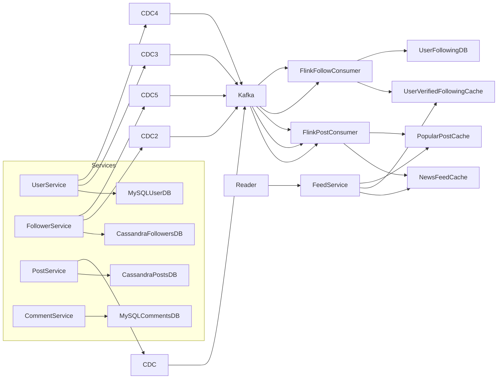
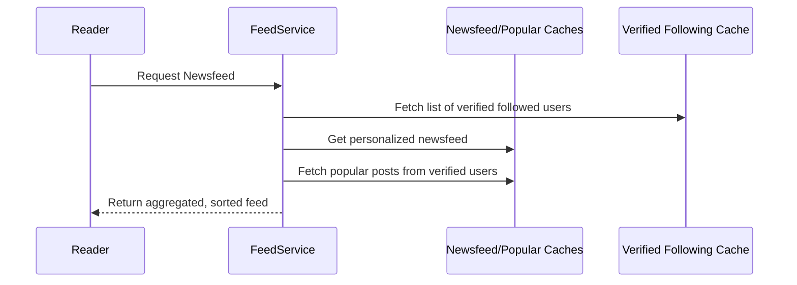

Here’s a structured and professional **README.md** file based on the content and design described in your video transcript. This version captures the architectural choices, technical trade-offs, and systems design approach used in building a scalable, distributed social media platform supporting Instagram, Twitter, Facebook, and Reddit-style features.

---

# Social Media Platform: High-Level System Design

This project is a full-scale, high-level system design for building four social media platforms — Instagram, Twitter, Facebook, and Reddit — in one architecture. It includes support for:

* Newsfeeds
* Reddit-style nested comments
* Follower/following relationships
* Configurable post privacy
* Read-optimized performance
* Popular post caching
* Stream processing with Change Data Capture (CDC)

---

## 🚀 Features

### ✅ Core Capabilities

* **Newsfeed Generation** (Push & Hybrid pull-push)
* **Follower/Following Tracking**
* **Per-user Post History**
* **Nested Comments (DFS-style expansion)**
* **Configurable Post Privacy (e.g., Close Friends)**
* **Verified User Detection and Popular Post Caching**

### 🧠 Optimization Focus

* Optimized for **read-heavy workloads**
* Uses **derived data and stream processing (Flink + Kafka)** for eventual consistency without two-phase commits
* **Change Data Capture** used extensively to ensure real-time sync across components

---

## 🏗️ High-Level Architecture

---

## 🧱 Data Model Summary

### 🧾 Users (MySQL)

* `user_id`
* `username`
* `is_verified`
* `profile_info`

### 🔁 Followers (Cassandra)

* **UserFollowers Table**

  * `user_id` (Partition Key)
  * `follower_id`
  * `privacy_level` (e.g., `all`, `close_friend`)
* **UserFollowing Table** (Derived from above)

### 📝 Posts (Cassandra)

* `user_id` (Partition Key)
* `post_id`
* `content`
* `timestamp`
* `privacy_level`

### 💬 Comments (MySQL with DFS Indexing)

* `post_id` (Partition Key)
* `comment_id`
* `parent_id`
* `depth_index` (e.g., `"A"`, `"AA"`, `"AB"` – for DFS-style loading)
* `content`

---

## 🧠 Design Highlights

### 🔄 Change Data Capture (CDC)

Used to asynchronously and reliably replicate updates from source-of-truth databases to derived tables and in-memory caches using Kafka and Flink.

### ⚡ High-Performance Newsfeeds

* Posts are fanned out asynchronously via CDC and Flink into **per-user Newsfeed Caches**.
* Verified users' posts are routed into a **Popular Post Cache** for efficient reads.

### 🗃️ Hybrid Fan-out

* **Normal users:** Posts pushed to followers’ caches.
* **Verified users:** Followers fetch posts directly from Popular Post Cache.

### 📚 Comment Tree Indexing

* Uses DFS-style `depth_index` strings for comment IDs.
* Enables efficient single-branch loading via range scans (e.g., load subtree `"AA"` to `"AB"`).

---

## 🛠️ Technologies

| Component           | Tech Choice       | Reasoning                                         |
| ------------------- | ----------------- | ------------------------------------------------- |
| Primary Datastore   | Cassandra + MySQL | Balance of high-throughput writes and consistency |
| Stream Processing   | Apache Flink      | Stateful, fault-tolerant, real-time processing    |
| Messaging           | Apache Kafka      | Replayable, durable, horizontally scalable        |
| In-memory Cache     | Redis             | Fast lookup for feeds and derived metadata        |
| Indexing (Comments) | DFS-Indexed MySQL | Simple, efficient depth-first traversal support   |

---

## 🔐 Post Privacy Levels

Privacy is enforced using the follower relationship metadata (`privacy_level`). Flink filters recipients during post fan-out based on this field.

---

## 📥 Feed Read Flow

---

## ⚠️ Known Trade-offs & Limitations

* **Eventual Consistency:** All derived data is asynchronously synced. Delays possible in reflecting privacy updates or new follows.
* **Memory Cost:** Caching per-user newsfeeds is expensive but acceptable at scale (e.g., \~20 TB/day).
* **Complexity:** Heavy use of Flink and CDC adds architectural overhead.

---

## 📌 Future Improvements

* Use **Raft-based** or LSM tree-based single-leader DB for better write throughput on comments
* Add **rate limiting** and abuse protection
* Expand security levels beyond just two (e.g., custom groups)
* Precompute **trending feeds** per region/language

